# 🌍 Wanderlust - Travel Planner

A modern, responsive travel planning web application built using Flask.  
Users can explore destinations, plan trips, manage budgets, and view weather using an interactive map.

---

## ✨ Key Highlights

- 🧭 Adaptive Navigation (Sidebar + Mobile Bottom Nav)
- 🗺️ Interactive Map with Location Search
- 🌦️ Real-time Weather Integration
- 💰 Smart Budget Planning System
- 🎨 Glassmorphism UI with Dark Mode
- 📱 Fully Responsive Design (Mobile + Tablet + Destop)

---

## 🚀 Features

### 👤 User Features
- User authentication (Login / Signup)
- Plan trips with destination, date, and budget
- Edit and delete trips
- Auto budget calculator (hotel, food, transport)
- Explore destinations with search
- Contact/Report admin system

---

### 🗺️ Map & Weather
- Search any city using OpenStreetMap
- Dynamic map rendering (Leaflet.js)
- Weather data based on selected location
- Clean dashboard layout (map + search + weather)

---

### ⚙️ Admin Features
- Manage destinations (Add / Edit / Delete)
- View user contact/Report messages

---

### 🎨 UI / UX Features
- Glassmorphism design system
- Dark / Light mode toggle (persistent)
- Responsive layout (desktop, tablet, mobile)
- Sidebar navigation (desktop)
- Bottom navigation (mobile)
- Toast notifications

---

## 🛠️ Tech Stack

### 🔹 Frontend
- HTML
- CSS 
- JavaScript
- Jinja2 Templates

### 🔹 Backend
- Python (Flask)

### 🔹 Database
- MySQL

### 🔹 APIs & Tools
- Leaflet.js (Map)
- OpenStreetMap (Geocoding)
- Weather API
- phpMyAdmin (DB management tool)
- Lucide Icons → UI icons

---

## 📸 Screenshots

### 🏠 Home Page
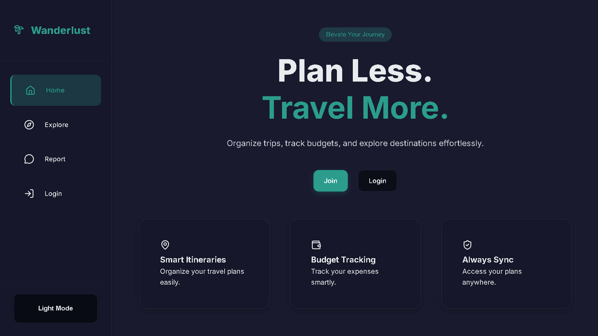

### 🔐 Login
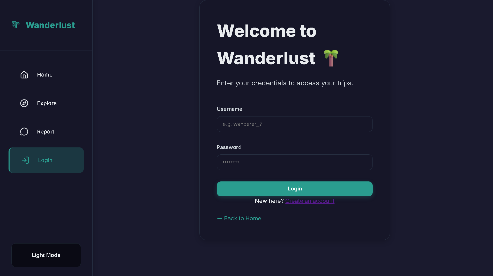

### 📍 Popular Destinations
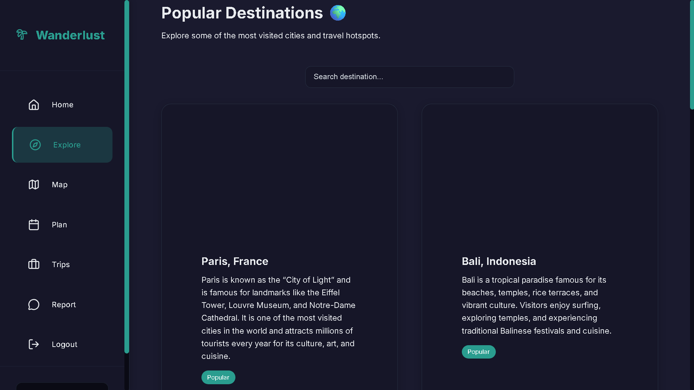

### 🗺️ Map + Weather
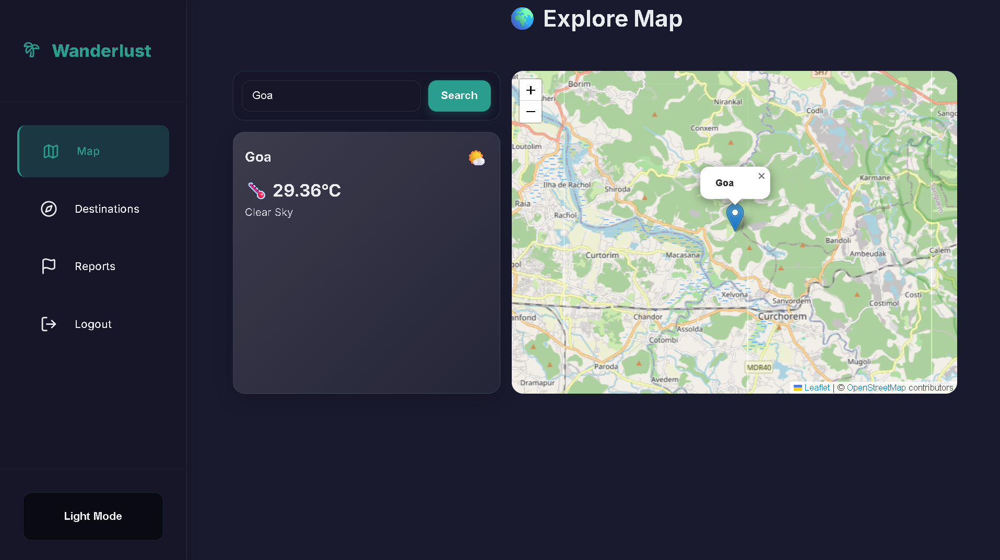

### 🧳 Trip Planner
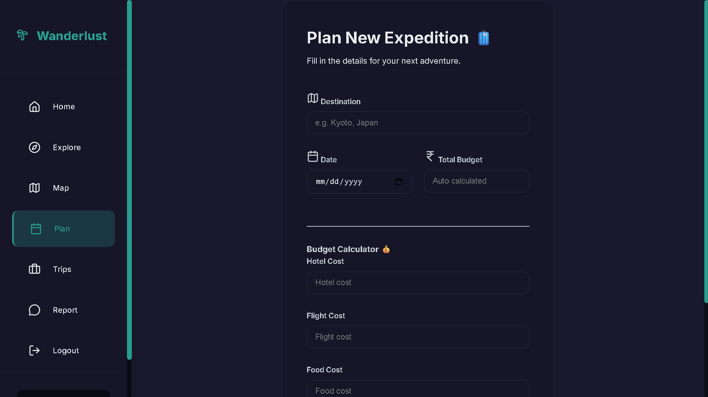

### 📊 Trip Management
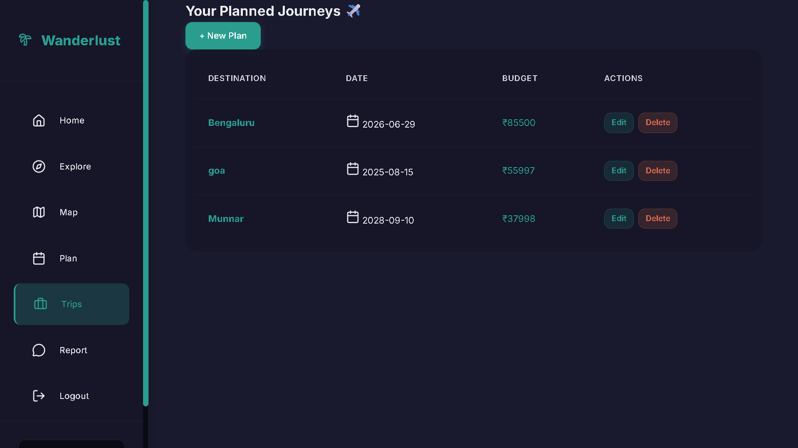

### 👤 User Dashboard
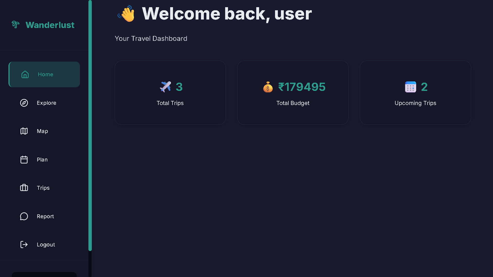

### ⚙️ Admin Panel
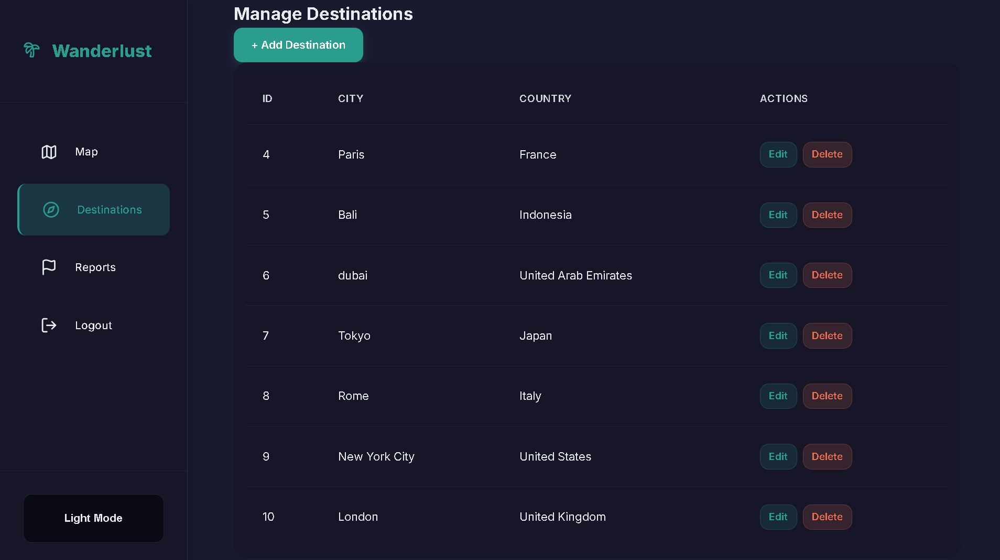

### 📩 Contact / Reports
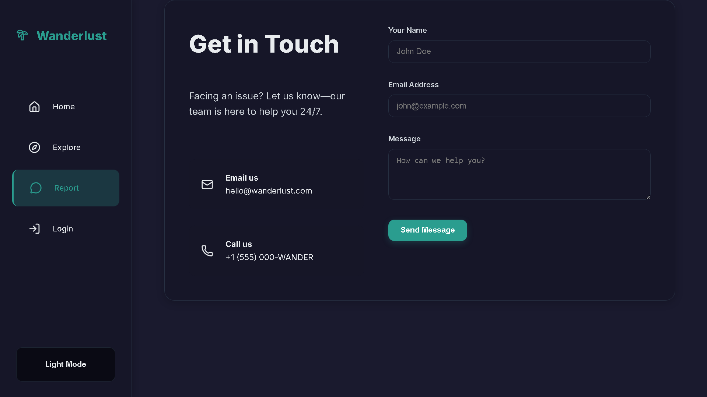

### 🏠 Mobile Home Page
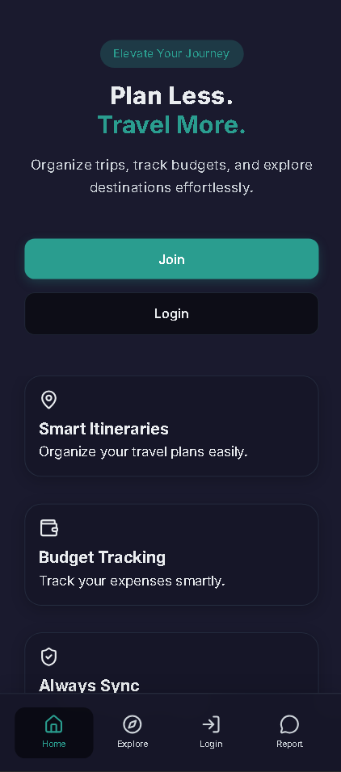

### 🏠 Mobile Home Map
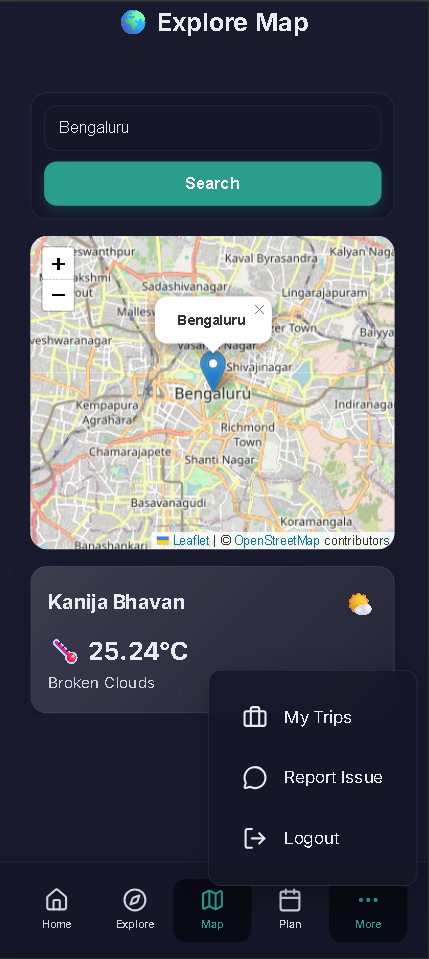

### 🏠 Mobile Dhashboard
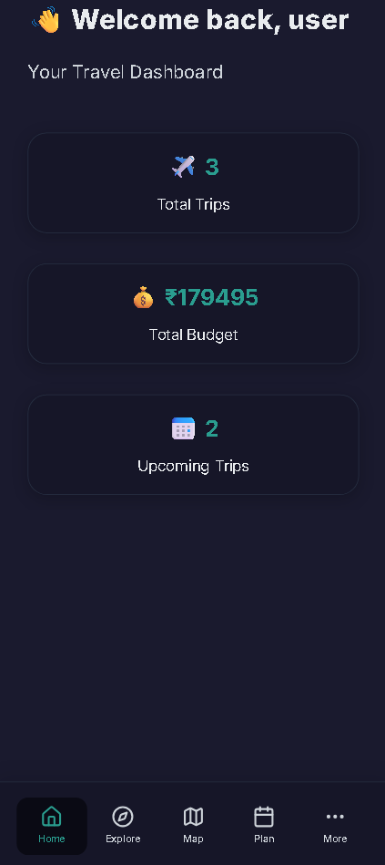

---

## 👨‍💻 Author

**Syed Althaf Ali**  
Building modern web applications with Flask & clean UI/UX  
 
🔗 LinkedIn: https://linkedin.com/in/syedalthafali16
